# Solving the "Audio Glitch" Nightmare in Python: A Producer-Consumer Approach 🎧🐍

If you have ever tried to build a real-time audio monitor in Python, you’ve likely hit the dreaded **Input Overflow**. You write a simple loop to read from the microphone, add some cool DSP (Digital Signal Processing) to analyze the sound, and suddenly it *pops, clicks, and glitches* - your audio stream is corrupted.

**Why?** Because you are trying to do too much in the critical path.

In my latest project, [umik-base-app](https://github.com/danielfcollier/py-umik-base-app/), I solved this by implementing a threaded **Producer-Consumer concurrency model** to strictly decouple hardware capture from signal processing.

## 🚫 The Problem: The Overflowing Ring Buffer

To understand why glitches happen, you have to look at how audio hardware talks to your OS. The microphone doesn't wait for your Python code; it writes data continuously into a **Circular Ring Buffer** (a small, fixed-size memory space) at a specific rate (e.g., 48,000 samples per second).

If your Python script takes too long to process a chunk - say, calculating an FFT or writing a file to a slow SD card - the hardware "head" catches up to the "tail."

> **The Result:** The hardware has no choice but to overwrite the old data you haven't read yet. This discontinuity in the waveform is what you hear as a "pop" or "click."

## ✅ The Solution: The Producer-Consumer Pattern

Instead of processing audio the moment I capture it, I split the application into two dedicated threads connected by a thread-safe `queue.Queue`.

Think of it like a busy restaurant kitchen:

1. 🎤 **The Producer** (`ListenerThread`) This thread has one job: listen. It continuously reads raw audio chunks from `sounddevice` and pushes them into the queue immediately. It does zero processing. If the hardware is ready, this thread is ready.

2. 🧠 **The Consumer** (`ConsumerThread`) This thread lives on the other side of the queue. It pulls the audio data and handles the heavy lifting - applying FIR calibration filters, calculating LUFS, and writing WAV files to disk.

### The Architecture Visualized

By introducing a Queue, a "shock absorber" is created between the rigid timing of hardware and the variable timing of software.

```mermaid
graph LR
    Hardware((🎤 UMIK)) -->|Raw Audio| Producer[Listener Thread]
    Producer -->|put_nowait| Queue[("Thread-Safe Queue")]
    Queue -->|get| Consumer[Consumer Thread]
    
    subgraph "The Brain (Consumer)"
        Consumer --> Disk[💾 Save WAV]
        Consumer --> Screen[📊 Update Meter]
    end
    
    style Queue fill:#f9f,stroke:#333,stroke-width:2px
    style Producer fill:#bbf,stroke:#333
    style Consumer fill:#bfb,stroke:#333
```



## 💻 The Code: Decoupling in Action

Here is a simplified look at how this pattern is implemented in Python. Note how the `ListenerThread` (Producer) uses `put_nowait()` to ensure it *never* blocks, even if the queue is full (though in practice, the queue's size is large enough to handle bursts).

```python
import queue
import threading

# The "Ticket Rail"
audio_queue = queue.Queue(maxsize=1000)

class ListenerThread(threading.Thread):
    def run(self):
        while True:
            # 1. Read from Hardware (Blocking only on the mic)
            data = stream.read(block_size)
            
            # 2. Push to Buffer immediately
            # We use put_nowait() so we never get stuck here
            audio_queue.put_nowait(data)

class ConsumerThread(threading.Thread):
    def run(self):
        while True:
            # 1. Pull from Buffer (Blocking if empty)
            data = audio_queue.get()
            
            # 2. Do Heavy Lifting (Disk I/O, FFT, Math)
            # If this takes 100ms, it's fine! The queue grows, but
            # the ListenerThread keeps running.
            process_audio(data)
            save_to_disk(data)
```

## ⚙️ Why This Is Essential for Edge Devices

🍓 This architecture is the only reason my UMIK-1 monitor runs flawlessly on resource-constrained devices like the **Raspberry Pi**.

On a standard desktop, your CPU might be fast enough to brute-force a single loop. But on a Pi, writing to an SD card can cause unpredictable latency spikes. By using the queue as an intermediary buffer, the Consumer thread can momentarily lag behind during a slow write operation without stopping the Producer from clearing the hardware buffer.

> **Zero Dropped Frames:** The result is a robust system that can record high-fidelity audio for days without missing a single sample.

Check out the [architecture docs](https://github.com/danielfcollier/py-umik-base-app/docs/ARCHITECTURE.md) in the repo for a deep dive! 👇

#Python #AudioEngineering #SoftwareArchitecture #RealTimeSystems #IoT #DSP #ProducerConsumer #Concurrency
