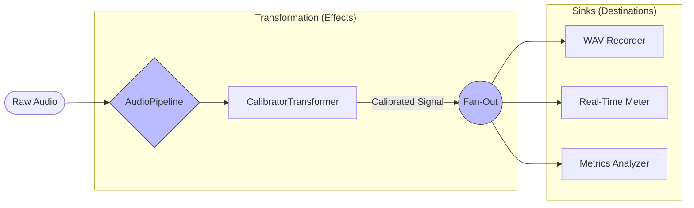

# Taming Complexity in Real-Time Audio with the Pipeline Pattern 🏗️🔊

When building audio applications, it’s easy to end up with a "God Object" loop - one giant function that reads audio, filters it, calculates metrics, updates the UI, and writes to disk. *It’s a maintenance nightmare.*

In my [umik-base-app](https://github.com/danielfcollier/py-umik-base-app/), I strictly avoided this by implementing the **Pipeline Pattern**.

## 🎸 The Metaphor: The Guitar Pedalboard

Think of the application not as a script, but as a **Signal Chain** - just like a guitarist's pedalboard or a studio mixing desk.

An audio signal enters at one end (Input). It passes through a series of effects (Transformers) that modify the sound. Finally, it reaches the amplifiers or recorders (Sinks) at the end of the chain.

In `umik-base-app`, I formalized this into two distinct component types:

1. **🧩 Transformers (The "Effects Pedals"):**
These take raw audio, modify it, and pass it on.
* *Example:* The `CalibratorTransformer`. It applies a real-time FIR filter to flatten the microphone's frequency response. The rest of the app doesn't even know it's happening - it just receives clean, "effected" audio.


2. **🚰 Sinks (The "Amps" & "Recorders"):**
These sit at the end of the chain. They consume the final signal to perform side effects (like saving a file or updating a screen) but return nothing.

## 🚀 The Power of "Fan-Out"

The real magic happens in the execution stage. The pipeline transforms the audio once, then **fans it out** to all registered Sinks simultaneously. This allows multiple distinct applications to run from a single audio stream.



## 💻 The API: Clean & Declarative

Because of this architecture, the main application code becomes incredibly readable. You don't write a loop; you just "plug in" the modules you want to use.

Here is what the setup looks like in Python:

```python
# Create the pipeline
pipeline = AudioPipeline()

# 1. Add Effects (Transformers)
# This applies the FIR filter to correct the UMIK-1's frequency response
pipeline.add_transformer(CalibratorTransformer("umik-1/700xxxx.txt"))

# 2. Plug in Destinations (Sinks)
# Record to disk...
pipeline.add_sink(WavRecorder(output_dir="./recordings"))

# ...AND display levels on screen at the same time.
pipeline.add_sink(DecibelMeter())

# 3. Start processing
pipeline.start()

```

## 🌟 Why This Approach Wins

By decoupling the "What" (processing) from the "How" (execution), you a gain massive benefits for developer experience:

* **Testability:** You can test the `DecibelMeter` logic by feeding it a fake numpy array. You don't need to sing into a real microphone to run your unit tests.
* **High Cohesion:** The Recorder only knows how to write files. The Meter only knows how to do math. They never talk to each other, so breaking one doesn't break the other.
* **Hot-Swappable:** Want to change from a local WAV recorder to a Cloud Uploader? Just write a new Sink class and `pipeline.add_sink(CloudUploader())`. The core logic remains untouched.

Check out the code in `src/umik_base_app/core/pipeline.py` to see how simple building complex audio tools can be! 👇

#SoftwareArchitecture #DesignPatterns #Python #AudioEngineering #PipelinePattern #CleanCode #Refactoring
