# Architecture Overview

This document describes the high-level software architecture of the `umik-base-app`. The application is designed for mission-critical audio monitoring using a **Producer-Consumer** pattern that can operate in two modes: **Monolithic** (Threaded) or **Distributed** (Process-Isolated).

## 1. Core Philosophy: The "Ear" vs. The "Brain"

To prevent audio glitches (buffer overflows), the application is decoupled into two distinct roles:

1.  **The Ear (Producer):**
    * **Responsibility:** Interacts with the hardware driver (`sounddevice`).
    * **Priority:** Critical. It must never block.
    * **Behavior:** Captures raw audio, timestamps it, and pushes it to the Transport Layer immediately.

2.  **The Brain (Consumer):**
    * **Responsibility:** Analysis, File I/O, Visualization.
    * **Priority:** Variable. It can lag behind without breaking the recording.
    * **Behavior:** Pulls data from the Transport Layer and executes the `AudioPipeline`.

## 2. Transport Layer (The Abstraction)

The "Ear" and "Brain" are connected by an abstract **Transport Layer**. This allows the application to switch its internal communication mechanism at runtime.

### Mode A: Monolithic (In-Memory Queue)
* **Flag:** Default (No flags).
* **Mechanism:** `queue.Queue` (Thread-Safe Memory).
* **Topology:** Single Python Process.
* **Pros:** Zero latency, simple to debug.
* **Cons:** Shared GIL (Global Interpreter Lock). Heavy processing in the Consumer can momentarily stall the Producer.

```mermaid
graph LR
    subgraph "Single Process (GIL Limited)"
        Mic((🎤 UMIK)) -->|Capture| L[Listener Thread]
        L -->|"queue.put()"| Q[Memory Queue]
        Q -->|"queue.get()"| C[Consumer Thread]
        C -->|Execute| P[Pipeline]
    end
```

### Mode B: Distributed (ZeroMQ / Process Isolation)

* **Flags:** `--producer` or `--consumer`.
* **Mechanism:** `ZeroMQ` (TCP Sockets via Pub-Sub).
* **Topology:** Multiple Isolated Processes (potentially across a network).
* **Pros:** * **Process Isolation:** The Producer can run as a high-priority system daemon (`nice -n -20`), completely immune to Consumer crashes or lag.
* **Remote Monitoring:** The Consumer can run on a different computer.

```mermaid
graph LR
    subgraph "Process 1: The Ear (Daemon)"
        Mic((🎤 UMIK)) -->|Capture| L[Listener Thread]
        L -->|"zmq.send()"| PUB[ZMQ PUB Socket]
    end

    PUB -.->|TCP/IP| SUB

    subgraph "Process 2: The Brain (App)"
        SUB[ZMQ SUB Socket] -->|"zmq.recv()"| C[Consumer Thread]
        C -->|Execute| P[Pipeline]
    end
```

## 3. The Audio Pipeline Pattern

Once the `ConsumerThread` retrieves data (from Queue or ZMQ), it passes it to the `AudioPipeline`. This pipeline implements a modular pattern consisting of **Transformers** and **Sinks**.

### Components

* `AudioTransformer` **(Transformers)**:
  * **Role**: Modifies the audio signal.
  * **Input**: Audio Chunk -> **Output**: Modified Audio Chunk.
  * **Example**: `CalibratorAdapter` applies an FIR filter to correct the frequency response.

* `AudioSink` **(Consumers)**:
  * **Role**: Consumes the final audio signal (side-effects only).
  * **Input**: Audio Chunk -> **Output**: None.
  * **Examples**:
  * `RecorderSinkAdapter`: Writes audio to a WAV file.
  * `AudioMetricsSink`: Calculates RMS/LUFS and logs them.

### Pipeline Diagram

## 4. Data Flow Overview

The lifecycle of a single audio chunk flows as follows:

1. **Hardware Capture**: `sounddevice` reads a block of samples (e.g., 1024 frames).

2. **Listener**: The `ListenerThread` receives this block and timestamps it.

3. **Transport**:
   - **Monolithic:** Pushes tuple `(chunk, timestamp)` to `queue.Queue`.
   - **Distributed:** Serializes tuple via `pickle` and broadcasts via `ZmqProducerTransport`.

4. **Consumption**: The ConsumerThread wakes up, retrieves/deserializes the block.

5. **Transformation**:
    - If a **Calibrator** is active, the pipeline applies an FIR filter (`scipy.signal.lfilter`).

6. **Sinking**:
   - **Recorder Sink**: Writes bytes to disk.
   - **Metrics Sink**: Calculates RMS, flux, or accumulates samples for LUFS measurement.
