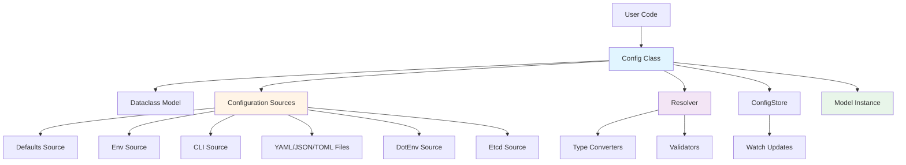
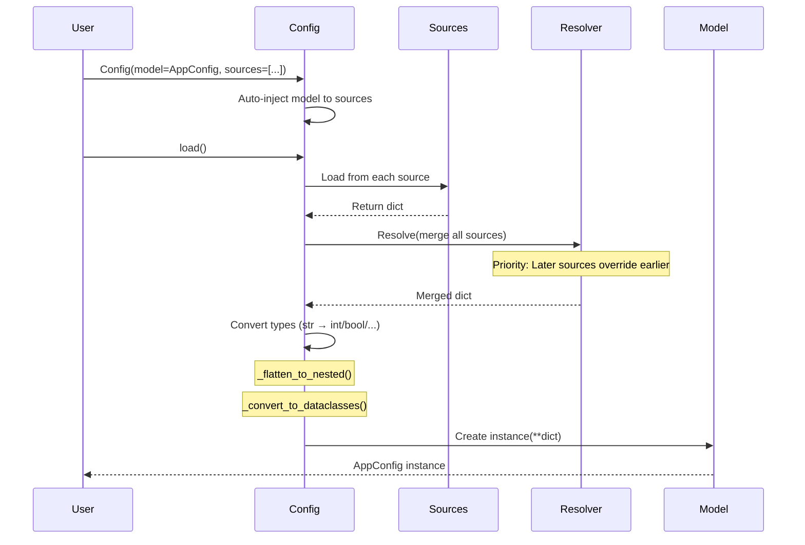
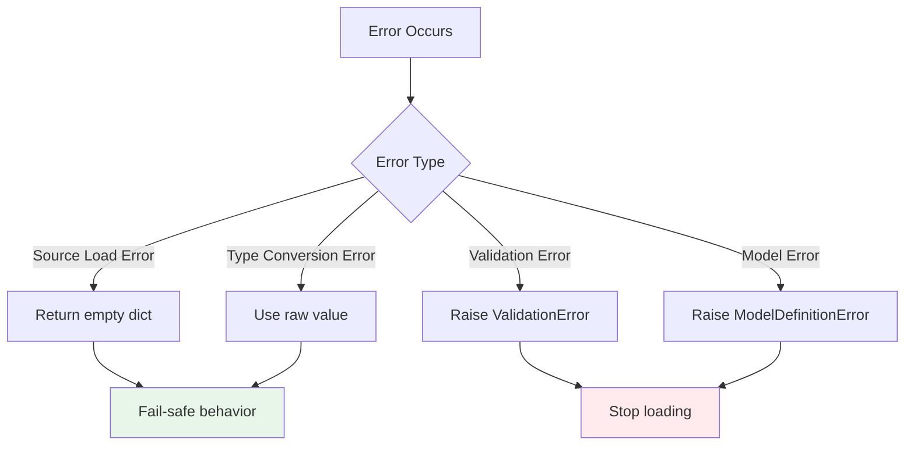
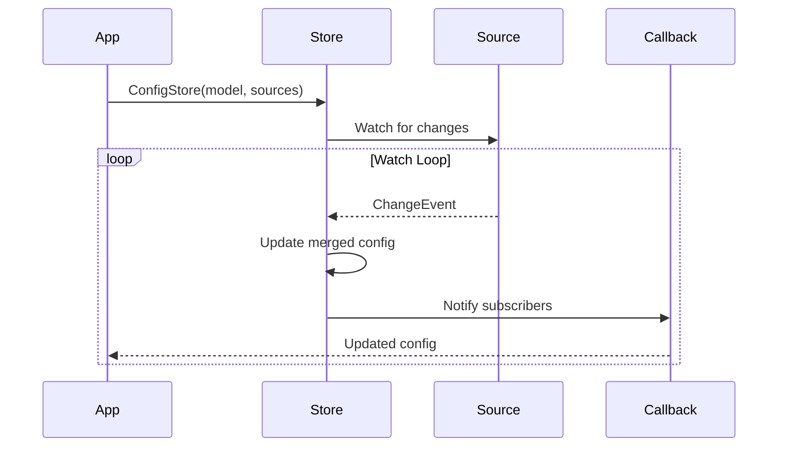
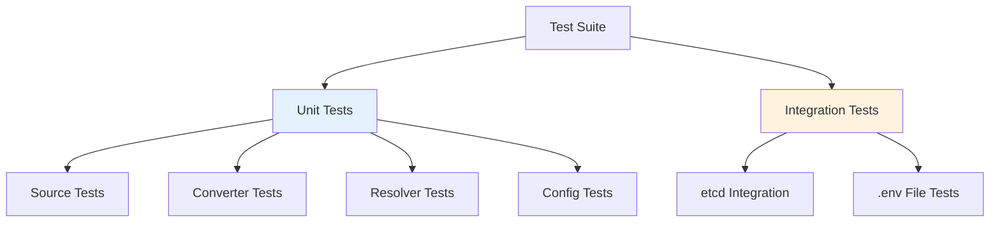

# Varlord Architecture

## System Overview

Varlord is a Python configuration management library that loads configuration from multiple sources and merges them with clear priority rules.

## Core Design Principles

1. **Model-driven**: Configuration sources automatically filter by model fields
2. **Auto-injection**: Model is automatically injected to all sources
3. **Flat keys**: Sources return flat dicts with dot notation (e.g., "db.host")
4. **Priority rule**: Later sources override earlier ones
5. **Type safety**: Automatic type conversion with validation

## Component Diagram



## Module Structure

```
varlord/
├── config.py          # Main entry point - orchestrates configuration loading
├── sources/           # Data source implementations
│   ├── base.py       # Source abstract base class
│   ├── defaults.py   # Model default values
│   ├── env.py        # Environment variables
│   ├── cli.py        # Command-line arguments
│   ├── json.py       # JSON file source
│   ├── yaml.py       # YAML file source
│   ├── toml.py       # TOML file source
│   ├── dotenv.py     # .env file source
│   └── etcd.py       # etcd key-value store
├── resolver.py        # Multi-source merging with priority
├── converters.py      # Type conversion (str → int/bool/float)
├── validators.py      # Validation utilities
├── model_validation.py # Model and config validation
├── policy.py          # PriorityPolicy for per-key priority rules
├── metadata.py        # Field info extraction from dataclasses
├── exporters.py       # Export config to JSON/YAML/TOML/ENV
├── store.py           # ConfigStore for dynamic updates
├── global_config.py   # Global config management (optional)
├── logging.py         # Internal logging utilities
└── exceptions.py      # Unified exception hierarchy
```

## Data Flow



## Key Algorithms

### 1. Source Priority Resolution

```
Defaults (auto) < User sources (order specified) < CLI (if included)

Example:
  sources = [Defaults(), Env(), DotEnv(), Etcd(), CLI()]
  Priority: Defaults < Env < DotEnv < Etcd < CLI
```

### 2. Key Normalization

All sources normalize keys using unified rules:

```
Input key         → Normalized key
─────────────────────────────────────────
DB__HOST          → db.host
APP__SERVER__PORT → app.server.port
K8S_POD_NAME      → k8s_pod_name
db.host           → db.host (already normalized)

Rules:
1. Convert to lowercase
2. Replace double underscores (__) with dots (.)
3. Preserve single underscores
```

### 3. Flat to Nested Conversion

```
Input:  {"db.host": "localhost", "db.port": 5432, "debug": true}
Output: {"db": {"host": "localhost", "port": 5432}, "debug": true}

Steps:
1. Separate flat keys from nested keys
2. Group nested keys by parent
3. Recursively process nested structures
4. Convert nested dicts to dataclass instances
```

## Type Conversion

```mermaid
graph LR
    A[String Input] --> B{Target Type}
    B -->|int| C[Integer Parser]
    B -->|float| D[Float Parser]
    B -->|bool| E[Boolean Parser]
    B -->|str| F[Pass Through]
    B -->|Optional[T]| G[Handle None]
    B -->|Dataclass| H[Nested Conversion]

    C --> I[Validated Value]
    D --> I
    E --> I
    F --> I
    G --> I
    H --> I
```

## Error Handling Strategy



## Dynamic Updates (ConfigStore)



## Extension Points

### Adding New Sources

```python
from varlord.sources.base import Source

class CustomSource(Source):
    @property
    def name(self) -> str:
        return "custom"

    def load(self) -> Mapping[str, Any]:
        # 1. Load configuration from custom source
        # 2. Return flat dict with normalized keys
        return {"key": "value"}

    def supports_watch(self) -> bool:
        return True/False

    def watch(self) -> Iterator[ChangeEvent]:
        # Optional: Implement watch for dynamic updates
        yield ChangeEvent(...)
```

### Custom Type Converters

```python
from varlord.converters import convert_value

# Register custom converter for Decimal type
def convert_decimal(value: str, **kwargs) -> Decimal:
    return Decimal(value)

# Use in model
@dataclass
class Config:
    price: Decimal = field(default=Decimal("0.00"))
```

## Performance Considerations

1. **Lazy Loading**: Sources only load when `Config.load()` is called
2. **Caching**: `ConfigStore` caches merged configuration
3. **Thread Safety**: `ConfigStore` uses locks for concurrent access
4. **Watch Optimization**: Only watch enabled sources use background threads

## Security Considerations

1. **TLS Verification**: etcd source validates certificates by default
2. **File Permissions**: Sources check file existence before loading
3. **Input Validation**: All user inputs are validated
4. **No Secrets**: No secret values hardcoded in source code

## Testing Strategy



## Future Enhancements

1. **Async Support**: Async loading and watching
2. **Schema Validation**: JSON Schema integration
3. **Hot Reload**: Automatic reload on file changes
4. **Metrics**: Prometheus metrics export
5. **Distributed Config**: Consul, ZooKeeper integration
