# Tier 1: Simple User Flow Diagram

This is the simplest visualization of how ADRI works - designed for new users to understand in 30 seconds.

## Mermaid Diagram Code

```mermaid
flowchart LR
    A[Your Function Called] --> B[🛡️ ADRI Intercepts]
    B --> C{Quality Check<br/>5 Dimensions}
    C -->|Score ≥ 75| D[✅ ALLOW<br/>Function Runs]
    C -->|Score < 75| E[❌ BLOCK<br/>Error Raised]
    D --> F[📋 Log Results]
    E --> F

    style A fill:#e3f2fd,stroke:#2196f3,stroke-width:2px
    style B fill:#fff3e0,stroke:#ff9800,stroke-width:3px
    style C fill:#f3e5f5,stroke:#9c27b0,stroke-width:2px
    style D fill:#e8f5e9,stroke:#4caf50,stroke-width:2px
    style E fill:#ffebee,stroke:#f44336,stroke-width:2px
    style F fill:#fafafa,stroke:#757575,stroke-width:1px
```

## Usage Context

This diagram should be used in:
- README.md (main landing page)
- Quick start guides
- Marketing materials
- Introductory presentations

## Key Messages

1. **One decorator** protects your function
2. **Automatic quality check** runs before your code
3. **Clear decision** - either allow or block
4. **Full audit trail** - every decision logged

## Design Rationale

- **5 boxes + decision diamond** = Easy to grasp in seconds
- **Color coding** = Visual reinforcement (green=good, red=bad)
- **Emojis** = Makes it friendly and memorable
- **Left-to-right flow** = Natural reading direction
- **No technical jargon** = Accessible to all audiences
