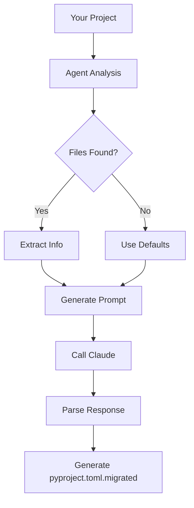

# 🚀 Wads CI Migration Agent - Package Overview

## 📦 What You Have

I've created a complete AI agent system to migrate your Python projects to the new wads v3 CI format with PEP 725/804 compliance. Here's everything included:

### Core Files

1. **`wads_ci_migration_agent.py`** (22KB) - The main agent
   - Complete migration logic
   - Claude Sonnet 4 integration
   - Regex-based CI analysis
   - DepURL conversion
   - PEP 725/804 alignment

2. **`demo_analysis.py`** (4.3KB) - Demo/test script
   - Analyze without API calls
   - See extracted information
   - Test regex patterns
   - Preview the prompt

3. **`test_agent.py`** (8.3KB) - Test suite
   - Unit tests for all helpers
   - Integration test scenarios
   - Pytest-compatible
   - Coverage for edge cases

### Documentation Files

4. **`README.md`** (11KB) - Main overview
   - Complete package description
   - Architecture explanation
   - Workflow details
   - Extension points

5. **`AGENT_README.md`** (8.8KB) - Full documentation
   - Installation guide
   - Usage examples
   - Troubleshooting
   - Advanced features

6. **`MIGRATION_QUICKSTART.md`** (6.5KB) - Quick start
   - 5-minute setup
   - Common scenarios
   - Pro tips
   - Checklists

7. **`EXAMPLE_OUTPUT.md`** (8.5KB) - Complete example
   - Before/after comparison (odbcdol project)
   - Detailed explanations
   - Design rationale
   - Next steps

### Configuration

8. **`requirements.txt`** (177B) - Dependencies
   - anthropic>=0.40.0
   - tomli & tomli-w (for TOML parsing)

## 🎯 Quick Start (Under 5 Minutes)

```bash
# 1. Setup (1 minute)
cd wads_ci_migration_agent
pip install -r requirements.txt
export ANTHROPIC_API_KEY='your-key-here'

# 2. Demo (30 seconds) - No API calls
python demo_analysis.py /path/to/your/project

# 3. Migrate (2 minutes)
python wads_ci_migration_agent.py /path/to/your/project

# 4. Review (2 minutes)
cd /path/to/your/project
cat pyproject.toml.migrated
```

## 🏗️ How It Works



### Analysis Phase
- Reads `pyproject.toml` or `setup.cfg`
- Parses `.github/workflows/ci.yml`
- Extracts: packages, env vars, Python versions
- Optional: Scans code for import-based inference

### Conversion Phase (by Claude)
- Maps packages → DepURLs
- Generates operational metadata
- Configures CI settings
- Preserves all existing config

### Output Phase
- Creates `pyproject.toml.migrated`
- Includes comments and rationale
- Explains decisions
- Suggests improvements

## 📊 What Gets Migrated

### ✅ System Dependencies

**From CI:**
```yaml
- run: sudo apt-get install -y unixodbc
```

**To pyproject.toml:**
```toml
[external]
host-requires = ["dep:generic/unixodbc"]

[tool.wads.external.ops.unixodbc]
canonical_id = "dep:generic/unixodbc"
install.linux = "sudo apt-get install -y unixodbc unixodbc-dev"
install.macos = "brew install unixodbc"
rationale = "ODBC driver manager..."
```

### ✅ Environment Variables

**From CI:**
```yaml
env:
  PROJECT_NAME: myproject
  DB_URL: ${{ secrets.DB }}
```

**To pyproject.toml:**
```toml
[tool.wads.ci]
project_name = "myproject"

[tool.wads.ci.env]
required = ["DB_URL"]
```

### ✅ Python Versions

**From CI:**
```yaml
matrix:
  python-version: ["3.10", "3.11", "3.12"]
```

**To pyproject.toml:**
```toml
[tool.wads.ci.testing]
python_versions = ["3.10", "3.11", "3.12"]
```

### ✅ Test Configuration

**From CI:**
```yaml
- run: pytest -v --cov=pkg
```

**To pyproject.toml:**
```toml
[tool.wads.ci.testing]
pytest_args = ["-v"]
coverage_enabled = true
```

## 🎓 Usage Examples

### Example 1: Basic Migration

```bash
# Migrate a simple project
python wads_ci_migration_agent.py ~/projects/mypackage

# Output: ~/projects/mypackage/pyproject.toml.migrated
```

### Example 2: With Code Analysis

```bash
# Infer dependencies from imports
python wads_ci_migration_agent.py ~/projects/mypackage --analyze-code

# Scans: import pyodbc → infers unixodbc needed
```

### Example 3: Batch Migration

```bash
# Migrate multiple projects
for proj in proj1 proj2 proj3; do
    python wads_ci_migration_agent.py ~/projects/$proj
done
```

### Example 4: Integration with Your Workflow

```python
from pathlib import Path
from wads_ci_migration_agent import analyze_project, run_migration_agent

# Just analyze (no API call)
analysis = analyze_project(Path('./myproject'), analyze_code=True)
print(f"Found: {analysis['system_packages']}")

# Full migration
run_migration_agent(Path('./myproject'))
```

## 🧪 Testing

### Run Unit Tests

```bash
pip install pytest
pytest test_agent.py -v
```

### Run Demo Mode

```bash
python demo_analysis.py /path/to/project --analyze-code
```

## 📚 Documentation Roadmap

1. **Start here:** `MIGRATION_QUICKSTART.md` (5-minute guide)
2. **For details:** `AGENT_README.md` (comprehensive docs)
3. **See example:** `EXAMPLE_OUTPUT.md` (before/after)
4. **Understand flow:** `README.md` (architecture)

## 🔧 Configuration

### Environment Variables

```bash
# Required
export ANTHROPIC_API_KEY='sk-ant-...'

# Optional (defaults to env var)
python wads_ci_migration_agent.py . --api-key sk-ant-...
```

### Agent Behavior

All behavior is controlled via the system prompt in `wads_ci_migration_agent.py`:
- PEP 725/804 compliance rules
- DepURL inference logic
- Output format specifications
- Decision-making guidelines

## 🎯 Success Metrics

A good migration produces:

- ✅ All system deps in `[external]` with DepURLs
- ✅ Operational metadata for each dependency
- ✅ Complete `[tool.wads.ci]` configuration
- ✅ Preserved original project settings
- ✅ Helpful comments and explanations
- ✅ Works with v3 CI workflow template

## 🐛 Common Issues & Solutions

### Issue: "No pyproject.toml found"

**Solution:** Create minimal config:
```bash
echo '[project]
name = "myproject"
version = "0.1.0"' > pyproject.toml
```

### Issue: Missing system dependencies

**Solution:** Run with code analysis:
```bash
python wads_ci_migration_agent.py . --analyze-code
```

### Issue: Wrong DepURL type

**Solution:** Claude usually gets it right, but you can manually edit:
```toml
# Change if needed
[external]
build-requires = ["dep:virtual/compiler/c"]  # not dep:generic/gcc
```

## 🚀 Next Steps

1. **Test the agent:**
   ```bash
   python demo_analysis.py /path/to/sample/project
   ```

2. **Migrate a project:**
   ```bash
   python wads_ci_migration_agent.py /path/to/your/project
   ```

3. **Review output:**
   ```bash
   cat /path/to/your/project/pyproject.toml.migrated
   ```

4. **Apply migration:**
   ```bash
   cd /path/to/your/project
   cp pyproject.toml pyproject.toml.backup
   mv pyproject.toml.migrated pyproject.toml
   ```

5. **Update CI workflow:**
   - Copy the v3 template to `.github/workflows/ci.yml`
   - Commit and push
   - Monitor CI run

## 📞 Support

- **Demo first:** `python demo_analysis.py .`
- **Check example:** `cat EXAMPLE_OUTPUT.md`
- **Read docs:** `cat AGENT_README.md`
- **Run tests:** `pytest test_agent.py -v`

## 🙏 Acknowledgments

This agent:
- Uses Claude Sonnet 4 (latest model)
- Implements PEP 725 & 804 standards
- Follows functional programming principles
- Embodies convention over configuration
- Prioritizes single source of truth

## 📄 License

Apache 2.0

---

## File Manifest

```
wads_ci_migration_agent/
├── wads_ci_migration_agent.py    # Main agent (22KB)
├── demo_analysis.py               # Demo script (4.3KB)
├── test_agent.py                  # Test suite (8.3KB)
├── requirements.txt               # Dependencies (177B)
├── README.md                      # This file (11KB)
├── AGENT_README.md                # Full docs (8.8KB)
├── MIGRATION_QUICKSTART.md        # Quick start (6.5KB)
└── EXAMPLE_OUTPUT.md              # Example (8.5KB)

Total: ~70KB of code + docs
```

## 🎉 You're Ready!

Everything you need to migrate your projects to wads v3 is in this package. Start with the quick start guide and you'll be migrating projects in minutes.

**First command to run:**
```bash
python demo_analysis.py /path/to/your/project
```

This shows you what the agent will analyze without making any API calls. Perfect for understanding what's happening before you commit to a migration.

Enjoy! 🚀
