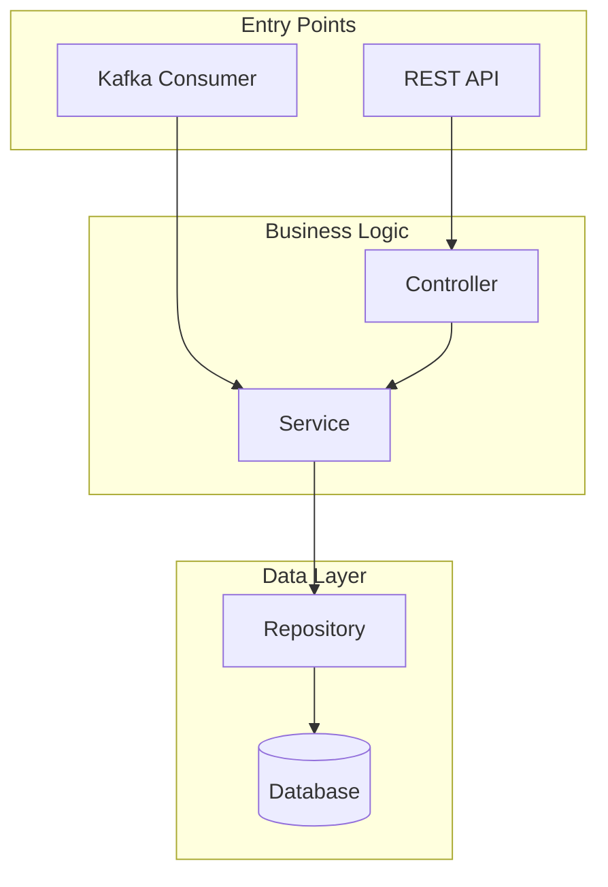
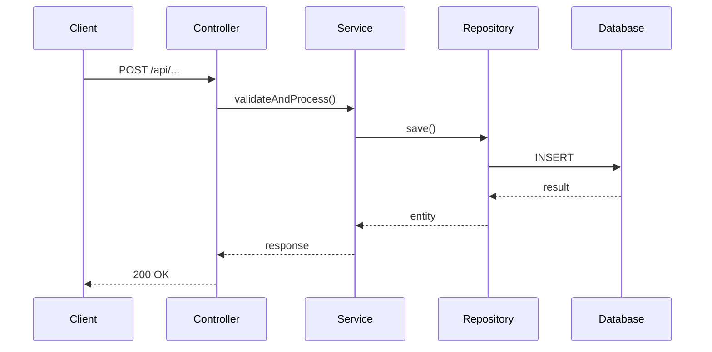

# Functional Component Documentation

Generate comprehensive documentation for a **functional component** - a group of code that delivers specific business functionality.

## Component Information

- **Name**: {{MODULE_NAME}}
- **Description**: {{MODULE_DESCRIPTION}}
- **Key Files**: {{MODULE_FILES}}
- **Path**: {{MODULE_PATH}}
- **Repository**: {{REPO_PATH}}

## Task

Create documentation that explains **what this component does** and **how it works** from a business and technical perspective.

### Step 1: Discover Entry Points

Find ALL entry points for this component:

1. **HTTP APIs** - Find route definitions, controllers
   - What endpoints exist?
   - What HTTP methods?
   - What do they do?

2. **Kafka/Event Handlers** - Find topic consumers/producers
   - What topics are consumed?
   - What events are published?
   - What triggers them?

3. **Internal Calls** - Find where other services call this
   - What functions are exported?
   - Who calls them?

### Step 2: Trace Each Flow

For each entry point, trace the complete flow:

```
Entry Point → Controller → Service → Repository → Database/External Service
```

Understand:
- What data comes in?
- What validation happens?
- What business logic runs?
- What data is stored/retrieved?
- What responses go out?
- What events are triggered?

### Step 3: Generate Documentation

Create a Markdown document with these sections:

---

#### 1. Overview

- **What it does**: Business purpose in plain language (2-3 sentences)
- **Key Capabilities**: Bullet list of main features
- **When to use**: Scenarios where this component is involved

#### 2. Entry Points

List ALL entry points with details:

**HTTP APIs:**

| Method | Endpoint | Description | Auth Required |
|--------|----------|-------------|---------------|
| POST | /api/v1/... | Does X | Yes |
| GET | /api/v1/... | Returns Y | Yes |

**Kafka Topics:**

| Topic | Type | Description |
|-------|------|-------------|
| topic.name | Consumer | Handles X events |
| topic.name | Producer | Publishes Y events |

**SQS Queues / Other:**

| Queue/Trigger | Type | Description |
|---------------|------|-------------|
| queue-name | Consumer | Processes X |

#### 3. Architecture

Show how the component is structured:



#### 4. Request/Response Flows

For each major entry point, show the sequence:

**Example: [API Name] Flow**



#### 5. Data Models

Document the key data structures:

**Request DTOs:**
```typescript
interface CreateXRequest {
  field1: string;  // Description
  field2: number;  // Description
}
```

**Response DTOs:**
```typescript
interface XResponse {
  id: string;
  // ...
}
```

**Database Entities:**
- Table/Collection name
- Key fields and their purpose
- Relationships

#### 6. Business Logic

Explain the core business rules:

1. **Rule 1**: Description of what happens and why
2. **Rule 2**: Description of validation/logic
3. **Edge Cases**: How special cases are handled

#### 7. Dependencies

**Internal Services Called:**
- ServiceA - for X functionality
- ServiceB - for Y functionality

**External APIs Called:**
- External Service 1 - endpoint, purpose
- External Service 2 - endpoint, purpose

**Events Published:**
- `event.name` - when X happens
- `event.name` - when Y happens

**Events Consumed:**
- `event.name` - triggers X
- `event.name` - triggers Y

#### 8. Error Handling

| Error | HTTP Code | When | How to Handle |
|-------|-----------|------|---------------|
| ValidationError | 400 | Invalid input | Fix request data |
| NotFoundError | 404 | Resource missing | Check ID |
| AuthError | 401 | Not authenticated | Login |

#### 9. Configuration

| Config/Env Var | Purpose | Default |
|----------------|---------|---------|
| ENV_VAR_NAME | Description | value |

#### 10. Usage Examples

**Example 1: [Use Case Name]**

```bash
# API call example
curl -X POST https://api.example.com/... \
  -H "Authorization: Bearer $TOKEN" \
  -d '{"field": "value"}'
```

**Example 2: [Another Use Case]**

```typescript
// Code example
const result = await service.doSomething(params);
```

---

## Output Guidelines

1. **Focus on functionality** - Document what it DOES, not just what files exist
2. **Include ALL entry points** - Don't miss APIs or event handlers  
3. **Trace complete flows** - Show the full path from request to response
4. **Use real names** - Actual function names, endpoints, topics from the code
5. **Add diagrams** - Mermaid diagrams for architecture and flows
6. **Be practical** - Include examples developers can copy-paste

## Output Format

Output a complete Markdown document. Start with:

```markdown
# {{MODULE_NAME}}

> {{MODULE_DESCRIPTION}}

## Overview
...
```
