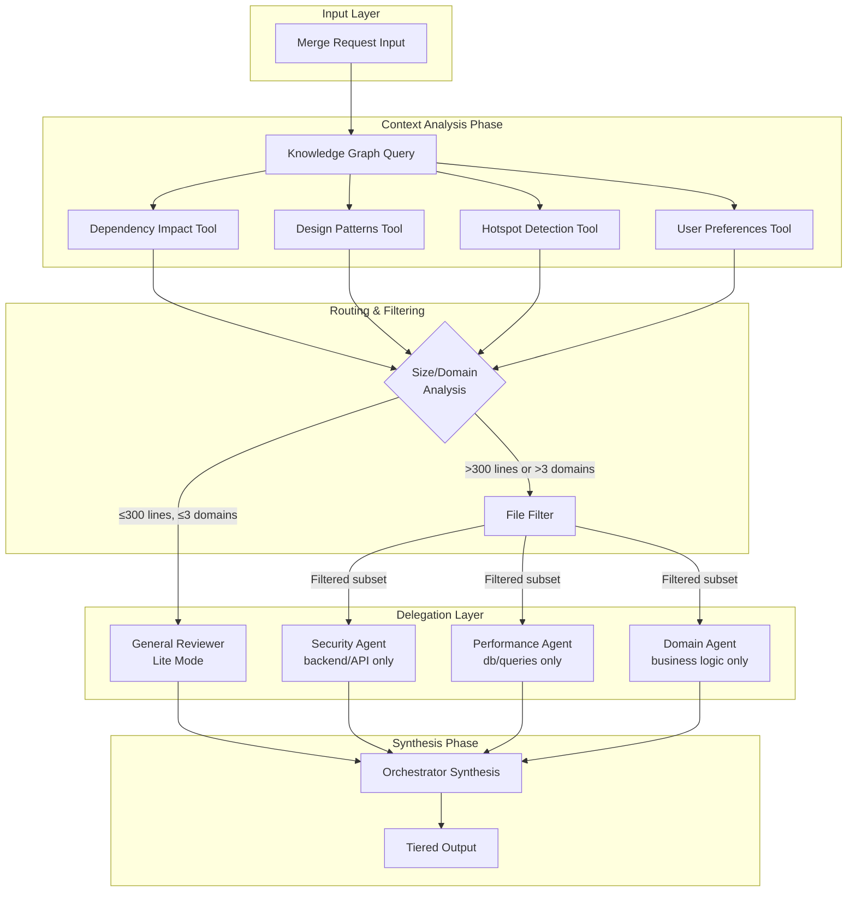

# AI Code Review Agent - Design Document

Design and implement a multi-agent code review orchestrator using LangGraph for high-throughput monorepo review.

---

## Architecture



---

## LangGraph State Machine

| Node | Purpose | Trigger Condition |
|------|---------|-------------------|
| `context_analyzer` | Query knowledge graph for dependencies, patterns, hotspots | Entry point |
| `routing_decision` | Analyze diff size and domain count | After context analysis |
| `security_agent` | Scan for SQLi, XSS, Auth issues | If delegation required |
| `performance_agent` | Detect N+1 queries, memory leaks | If delegation required |
| `domain_agent` | Validate business logic | If delegation required |
| `synthesizer` | Filter, de-conflict, format output | After all reviews complete |

---

## Drift Prevention Tools

### 1. DependencyImpactTool
Queries: What modules depend on the modified files?  
Implementation: Graph database (Neo4j) or AST-based dependency parser

### 2. DesignPatternTool
Queries: What is the established pattern for this module?  
Implementation: Vector store (Chroma) with pattern embeddings

### 3. HotspotDetectorTool
Queries: Have these files changed frequently recently?  
Implementation: Git history analysis + caching layer

### 4. UserPreferencesTool
Queries: What feedback has the user given on similar code patterns?  
Implementation: Vector store of previous PR comments (LGTM, rejections)

> **Important:** The `UserPreferencesTool` enables dynamic alignment—the agent learns from "Please don't do this" comments to avoid repeating past mistakes.

---

## File Filter Rules

| Agent | Included Patterns | Excluded Patterns |
|-------|------------------|-------------------|
| Security | `**/api/**`, `**/auth/**`, `**/backend/**` | `*.css`, `*.test.*` |
| Performance | `**/db/**`, `**/queries/**`, `**/models/**` | `*.md`, `**/__mocks__/**` |
| Domain | `**/services/**`, `**/domain/**`, `**/core/**` | `**/tests/**`, `**/config/**` |

---

## High-Throughput Design

1. **Parallel Sub-Agent Execution**: LangGraph's `Send` API enables concurrent sub-agent processing
2. **Async LLM Calls**: All LLM invocations use `ainvoke()` for non-blocking I/O
3. **Batched Embedding Lookups**: RAG tools batch multiple file lookups per request
4. **Connection Pooling**: Database connections use async pools
5. **Checkpointing**: Enable persistence for fault-tolerance on long reviews

---

## CLI Usage

```bash
# Review a GitHub PR
python -m cr_agent.main --github vllm-project/vllm --pr 32263

# Review a GitLab MR
python -m cr_agent.main --gitlab 12345 --mr 789

# Run sample review
python -m cr_agent.main --sample

# Options
--model MODEL   # LLM model (default: gpt-5-mini-2025-08-07)
--quiet         # Reduce verbosity
```

---

## Phase-Based Observability

```
PHASE 1: Workflow Initialization (gpt-5-mini-2025-08-07)
✓ Built LangGraph workflow with parallel execution

PHASE 2: Executing Review Workflow
   Steps: Context Analysis → Routing → [Parallel Agents] → Synthesis
⏳ Running agent workflow (async)...

PHASE 3: Final Output
# Code Review Results
## 1. Executive Summary: Request Changes
...
```
